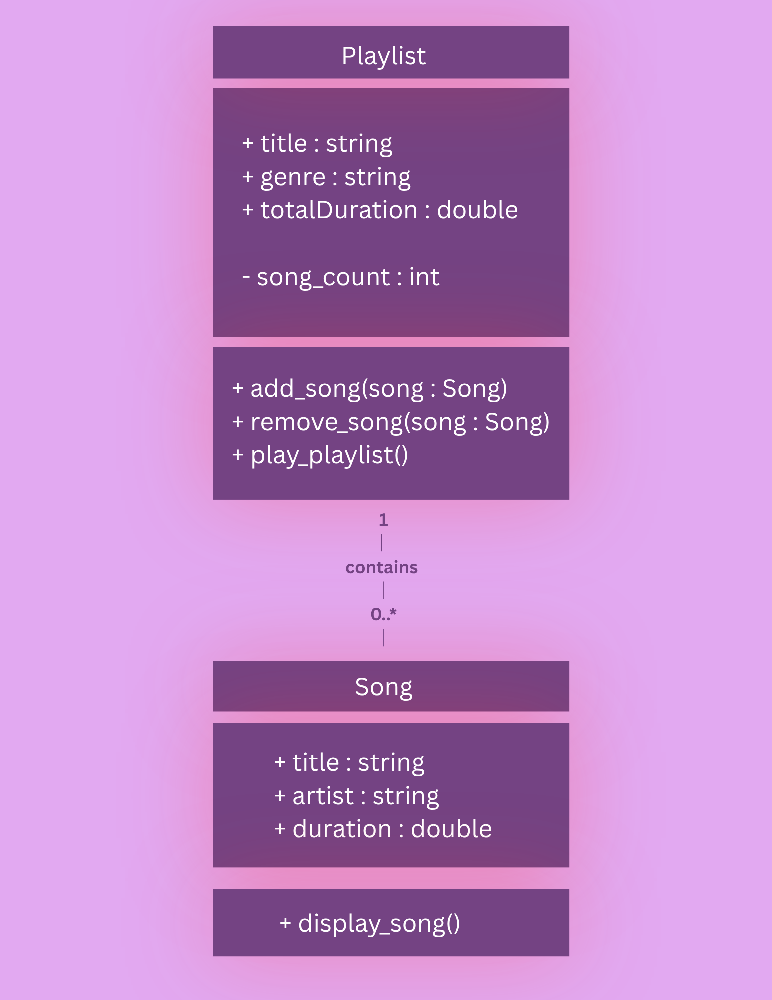
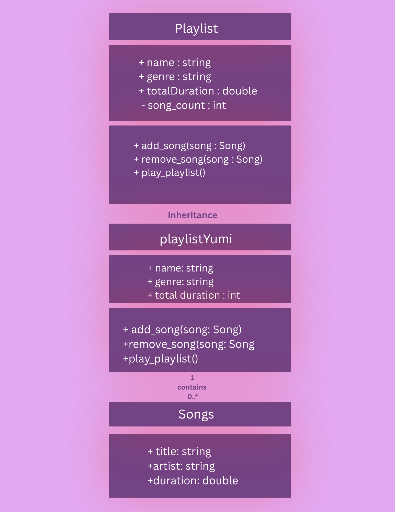

# Advanced Class Relationships

## Previous Activities
[classAttrib](q1/ClassAttributesMethods.md)
[classRel](q1/ClassRelationships.md)

## Existing System Description:
The system provides a playlist management where users can add or remove songs from it. Each playlist contains informaition such as its name, genre, total duration, and number of songs.

## Inheritance Relationship
Parent: PLaylist
Child: playlistYumi
Explanation: The playlistYumi is a type of Playlist, so it lies under Playlist. It inherits the properties and methods of Playlist.

## Inheritance UML

## Composition/Aggregation
Relationship: Playlists contains a collection of Songs
Explanation: A playlist consist of multiple song objects. Songs can exist independently of a Playlist, therefore it represents an aggregation.

## Advanced UML Diagram

## Python Implementation
[Source Code](advancedRelationships.py)
class Song:

    def __init__(self, title, artist, duration):
        self.title = title
        self.artist = artist
        self.duration = duration

class Playlist:

    def __init__(self, name, genre, total_duration, song_count):
        self.name = name
        self.genre = genre
        self.totalDuration = total_duration
        self.songs = []

    def add_song(self, song):
        self.songs.append(song)

    def remove_song(self, song):
        if song in self.songs:
            self.songs.remove(song)
        else:
            print("Song is not in the playlist.")

    def play_playlist(self):
        print("Playing playlist:", self.name)

# Song Objects
song1 = Song("Beautiful", "Bazzi", 3.0)
song2 = Song("Sober", "Bazzi", 4.0)

# Playlist Objects
playlistYumi = Playlist("LAUV_ontop", "Pop", 0, 0)

playlistYumi.add_song(song1)
playlistYumi.add_song(song2)

print("name:", playlistYumi.name)
print("genre:", playlistYumi.genre)
print("total duration:", playlistYumi.totalDuration)

print("Songs:")

for song in playlistYumi.songs:
    print(song.title, "-", song.artist, "-", song.duration)

print("song count:", len(playlistYumi.songs))

playlistYumi.play_playlist()

## Test Run

## Object Diagram

## Reflection
Answers: