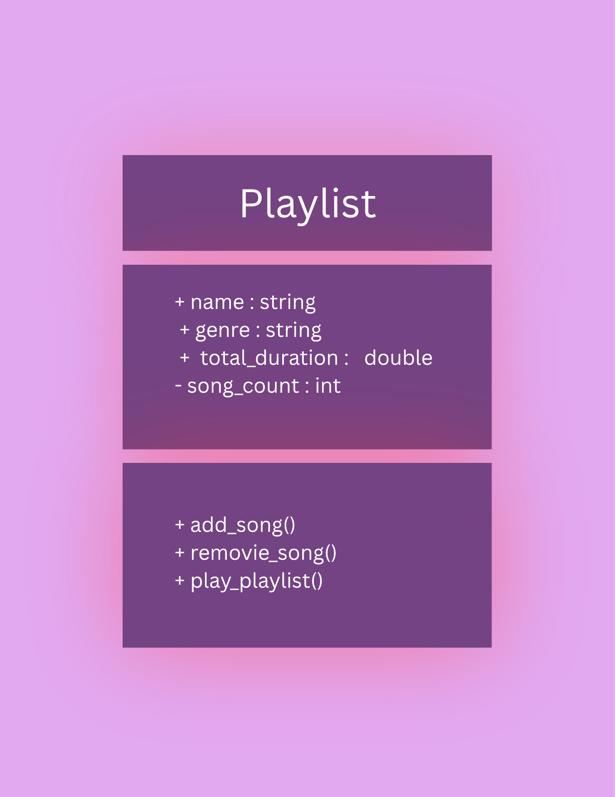
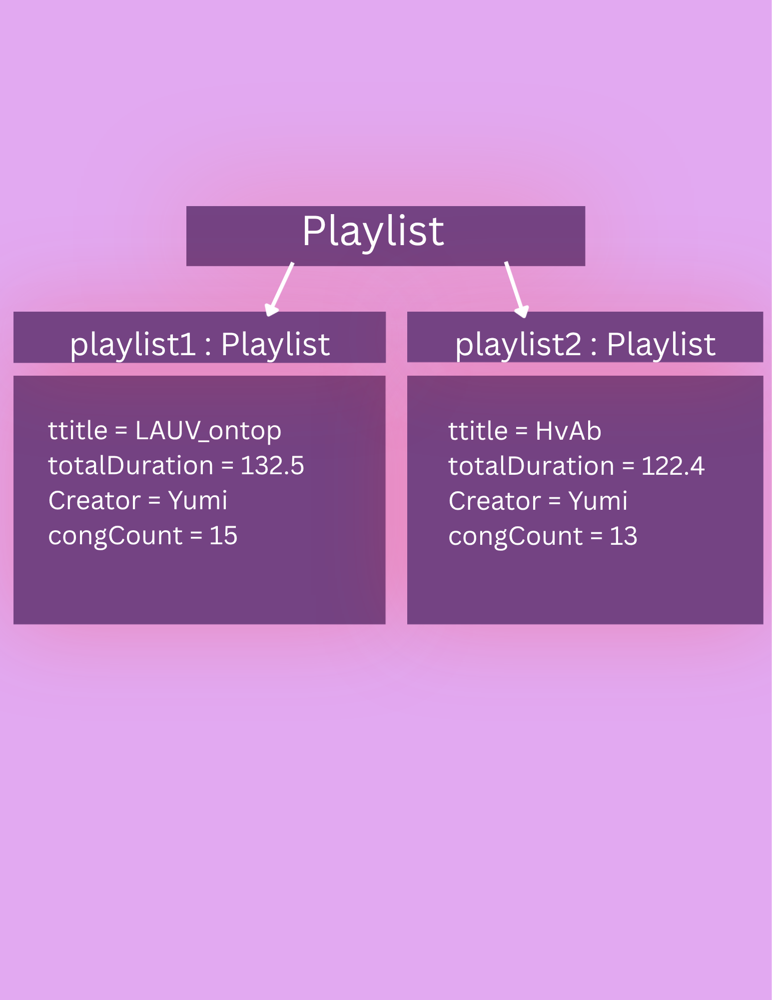

# Class Attributes and Methods

## Previous Design 
Link to my previous activity:
https://github.com/yumi-b4/9siliconcs3

## Design Revision
Changes from my previous design:
I kent the original methods that are related to playlist but only improved them so they can change the playlist’s information
I kept the name, creator, count and duration as part of the Playlist class.

## Visibility Decisions

| Attribute       | Data Type | Visibility | Reason                                                                                 |
|-----------------|-----------|------------|----------------------------------------------------------------------------------------|
| `title`         | string    | **Public** | The title is general information about the playlist and can be accessed normally.      |
| `totalDuration` | double    | **Public** | The total duration can be viewed as general playlist information.                      |
| `creator`       | string    | **Public** | The creator's name is general information about the playlist.                          |
| `songCount`     | int       | **Private**| The number of songs should be controlled by methods instead of being changed directly. |

## Updated UML Class Diagram 

## Python Implementation
class Playlist:
    def __init__(self, title, totalDuration, creator, songCount):
        self.title = title
        self.totalDuration = totalDuration
        self.creator = creator
        self.__songCount = songCount

    def add_song(self, amount):
        self.__songCount += amount

    def remove_song(self, amount):
        if amount <= self.__songCount:
            self.__songCount -= amount
        else:
            print("Cannot remove more songs than the playlist contains.")

    def display_playlist(self):
        print("Title:", self.title)
        print("Total Duration:", self.totalDuration, "minutes")
        print("Creator:", self.creator)
        print("Song Count:", self.__songCount)

    def get_song_count(self):
        return self.__songCount

# Create two Playlist objects
playlist1 = Playlist("Study Playlist", 120.5, "Maria", 10)
playlist2 = Playlist("Workout Playlist", 75.0, "Maria", 15)

# BEFORE
print("--- BEFORE ---")
print("Playlist 1:")
playlist1.display_playlist()

print()

print("Playlist 2:")
playlist2.display_playlist()

# Change only Playlist 1
print("\nAdding 3 songs to Playlist 1...")
playlist1.add_song(3)

# AFTER
print("\n--- AFTER ---")
print("Playlist 1:")
playlist1.display_playlist()

print()

print("Playlist 2:")
playlist2.display_playlist()

## Test Run 

## Object Diagram 

## Analysis 
### What did you make your chosen attribute private?
I chose the songCount attribute to be private, for I want its value to be controlled by the methods of the Playlist class. If other fuctions of parts could change it directly then they might provide the playlist wrong number of songs. I made it private to allow the value to be changes safely through methods I have chosen such as the add_song() or remove_song().

### Which method changes the state of your object?
The method that changes the state of my Playlist is the add_song(). It will affect the provate songCount attribute in a way where it can increase its value based on the amount it is provided in the perimeter. In my code and testing, playlist1 originally has 15 songs, and after calling add_song(3), which adds the value inside the perimeter,its song count became 18. 

### How did your two objects demonstrate that instances are independent?
I created two playlists from the same class which is playlist. When I added three songs to one playlist, its song count changed from 15 to 18, while the other playlist remained at 13 songs which shows that each of the playlist object has its own seperate state.

### What is the difference between your class diagram and your object diagram?
The class diagram shows the playlist class as its blue print, a root to its attributes, data types, visibility, and methods. While on the other hand, the object diagram presents the actual objects created from the class and their each currect values. 